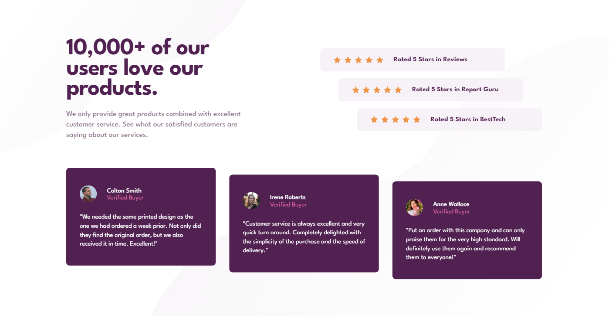

# Frontend Mentor - Social proof section solution

This is a solution to the [Social proof section challenge on Frontend Mentor](https://www.frontendmentor.io/challenges/social-proof-section-6e0qTv_bA).

## Table of contents

- [Overview](#overview)
  - [Challenge](#challenge)
  - [Screenshot](#screenshot)
  - [Links](#links)
- [My process](#my-process)
  - [Built with](#built-with)
  - [What I learned](#what-i-learned)
- [Author](#author)

## Overview

### Challenge

Users should be able to:

- View the optimal layout for the section depending on their device's screen size.

### Screenshot



### Links

- Solution URL: [See the code on GitHub](https://github.com/KristinaRadosavljevic/social-proof-section)
- Live Site URL: [View live site](https://social-proof-section-nine-red.vercel.app/)

## My process

### Built with

- Semantic HTML5 markup
- CSS/Sass
- CSS grid
- Flexbox
- Animations
- Media queries

### What I learned

This project challenged me to get more comfortable with using grid layout, but I also threw in some animations and Sass mixins for fun. For example, it was very rewarding to find a way to reuse an animation with different parameters by using a mixin to implement it in various elements:

```scss
@keyframes entering {
  to {
    opacity: 1;
    transform: translate(0, 0);
  }
}

@mixin add-animation($position-x, $position-y, $delay: 0s) {
  transform: translate($position-x, $position-y);
  opacity: 0;
  animation: entering 1s $delay ease-out forwards;
}
```

## Author

- LinkedIn - [Kristina Radosavljevic](https://www.linkedin.com/in/radosavljevic-kristina/)
- GitHub - [KristinaRadosavljevic](https://github.com/KristinaRadosavljevic)
- Frontend Mentor - [@KristinaRadosavljevic](https://www.frontendmentor.io/profile/KristinaRadosavljevic)
